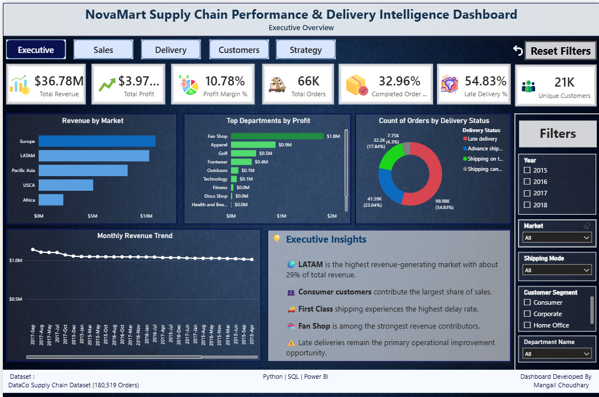
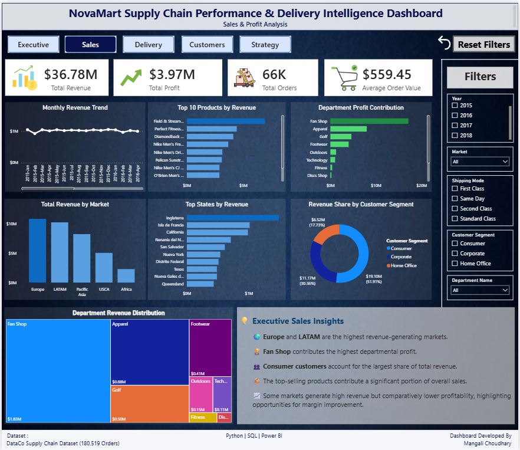
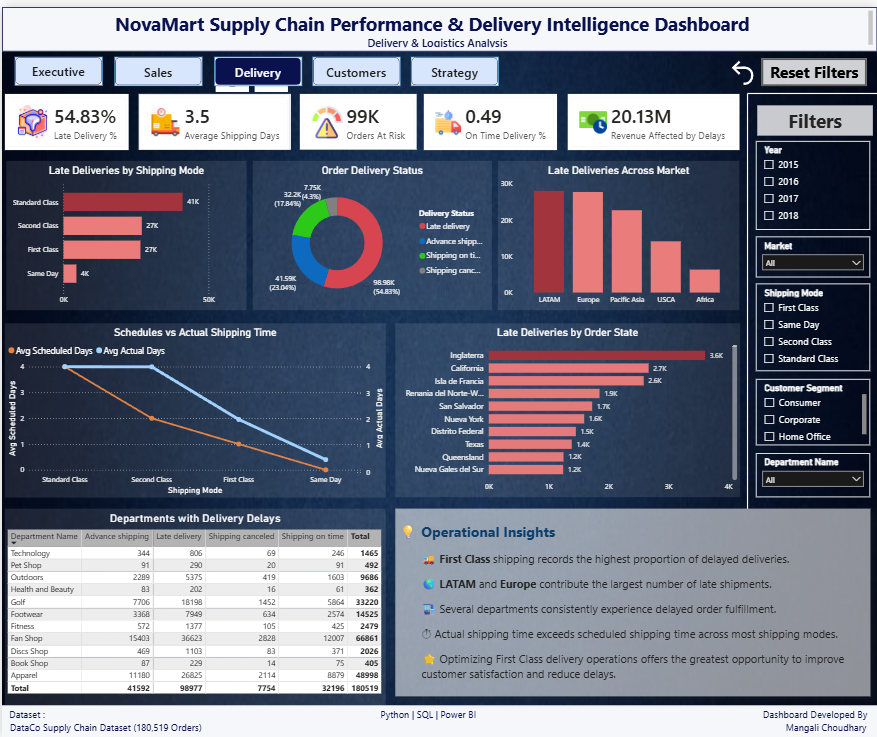
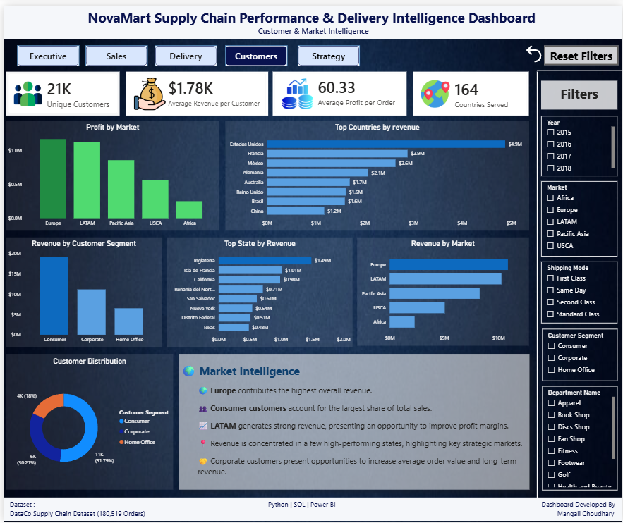
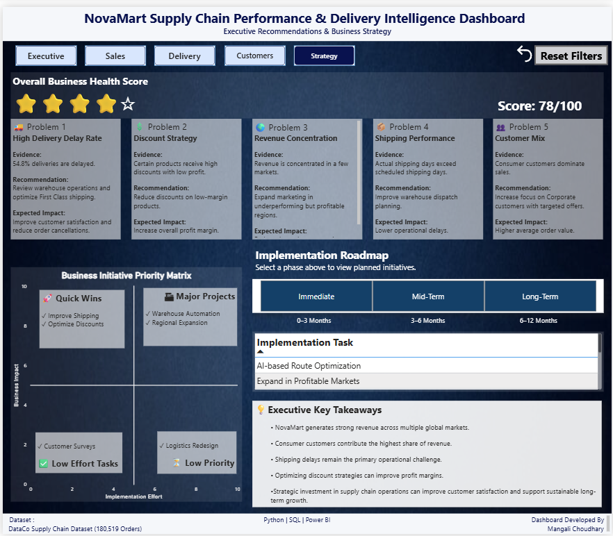

# 📦 NovaMart Supply Chain Performance & Delivery Intelligence Dashboard

<p align="center">
  
</p>

<p align="center">


</p>

---

# 📖 Project Overview

NovaMart Supply Chain Analytics is an **end-to-end Data Analytics project** built using **Python, SQL, and Power BI**.

The objective of this project is to transform raw supply chain transaction data into meaningful business insights that help management improve sales performance, optimize logistics, reduce delivery delays, and make data-driven strategic decisions.

The project demonstrates the complete analytics workflow from **data cleaning** to **interactive dashboard development**.

---

# 🎯 Business Objectives

✔ Analyze overall sales performance

✔ Identify profitable markets and departments

✔ Investigate delivery delays

✔ Understand customer purchasing behavior

✔ Measure operational efficiency

✔ Provide actionable business recommendations

---

# 📊 Dataset Information

| Attribute | Value |
|------------|-------|
| Dataset | DataCo Supply Chain Dataset |
| Records | **180,519** |
| Columns | **48** |
| Domain | Supply Chain & Logistics |
| Tools Used | Python, SQL, Power BI |

---

# 🛠 Tech Stack

| Category | Technologies |
|-----------|--------------|
| Programming | Python |
| Database | MySQL |
| Data Cleaning | Pandas, NumPy |
| Visualization | Power BI |
| Data Modeling | Power Query |
| Measures | DAX |
| Version Control | Git & GitHub |

---

# 🔄 Project Workflow

```text
Raw Dataset
      │
      ▼
Data Cleaning (Python)
      │
      ▼
Exploratory Data Analysis
      │
      ▼
Business Investigation
      │
      ▼
SQL Analysis
      │
      ▼
Power BI Data Modeling
      │
      ▼
Interactive Dashboard
      │
      ▼
Business Insights & Recommendations
```

---

# 📂 Repository Structure

```text
NovaMart-SupplyChain-Analytics
│
├── data
│   ├── raw
│   └── cleaned
│
├── notebooks
│   ├── 01_Data_Cleaning.ipynb
│   ├── 02_EDA.ipynb
│   └── 03_Business_Investigation.ipynb
|   └── 04_ETL.ipynb 
│
├── sql
│   ├── Database_Setup.sql
│   └── Business_Queries.sql
|   └── Data_Validation.sql
|   └── Advance_Queries.sql
│
├── dashboard
│   ├── NovaMart_Dashboard.pbix
│   ├── Dashboard.pdf
│   ├── Executive.png
│   ├── Sales.png
│   ├── Delivery.png
│   ├── Customers.png
│   └── Strategy.png
│
├── presentation
│   └── Project_Presentation.pptx
│
├── images
│   └── Banner.png
│
├── README.md
└── requirements.txt
```

---

# 📈 Key Performance Indicators (KPIs)

- 💰 Total Revenue
- 💰 Total Profit
- 📦 Total Orders
- 👥 Unique Customers
- 📈 Profit Margin %
- 🚚 Late Delivery %
- ✅ Completed Orders %
- 📅 Average Shipping Days
- 💵 Average Order Value
- 🌍 Countries Served

---

# 📌 Business Questions Answered

- Which markets generate the highest revenue?
- Which products contribute the most revenue?
- Which departments generate the highest profit?
- Which shipping mode has the highest delay rate?
- Which customer segment contributes the most sales?
- Which countries and states generate maximum revenue?
- How does monthly revenue change over time?
- Which operational issues impact business performance?

---

# 📷 Dashboard Preview

## 🏠 Executive Overview





---

## 💰 Sales & Profit Analysis





---

## 🚚 Delivery & Logistics Analysis





---

## 👥 Customer & Market Intelligence





---

## 📋 Business Strategy & Recommendations





---

# 💡 Key Insights

- 🌍 Europe and LATAM generate the highest revenue.
- 👥 Consumer customers contribute the largest share of sales.
- 🚚 First Class shipping experiences the highest delivery delay percentage.
- 🏆 Fan Shop is one of the highest profit-generating departments.
- ⚠ Late deliveries remain the biggest operational challenge.
- 📈 Revenue is concentrated within a few high-performing markets.

---

# 📊 Dashboard Features

### Executive Dashboard

- Revenue KPIs
- Profit KPIs
- Market Analysis
- Department Analysis
- Monthly Revenue Trend

---

### Sales Dashboard

- Product Performance
- Revenue Distribution
- Department Contribution
- Customer Segment Analysis

---

### Delivery Dashboard

- Shipping Performance
- Delay Analysis
- Delivery Status
- Logistics Insights

---

### Customer Dashboard

- Customer Segmentation
- Country-wise Revenue
- Market Performance
- Profit Distribution

---

### Strategy Dashboard

- Business Health Score
- Priority Matrix
- Implementation Roadmap
- Executive Recommendations

---

# ⭐ Skills Demonstrated

- Data Cleaning
- Exploratory Data Analysis
- SQL Query Writing
- Business Analytics
- Data Modeling
- Power Query
- DAX Measures
- Dashboard Design
- Data Storytelling
- Business Intelligence

---

# 🚀 How to Run

### Clone Repository

```bash
git clone https://github.com/YourUsername/NovaMart-SupplyChain-Analytics.git
```

### Open Power BI Dashboard

```
dashboard/NovaMart_Dashboard.pbix
```

### Run Python Notebooks

```
notebooks/
```

### Execute SQL Queries

```
sql/Business_Queries.sql
```

---

# 📜 Project Outcome

This dashboard enables business stakeholders to:

- Monitor KPIs in real time
- Identify operational bottlenecks
- Improve delivery performance
- Optimize pricing strategy
- Increase customer satisfaction
- Support strategic decision-making

---

# 👩‍💻 Author

**Mangali Choudhary**

Computer Science Engineering Student

📧 Email: mangalichoudhary383@gmail.com

💼 LinkedIn: https://linkedin.com/in/mangali-choudhary-009a79345

🐙 GitHub: https://github.com/Mangali585

---

# ⭐ If you found this project helpful, consider giving it a Star!
